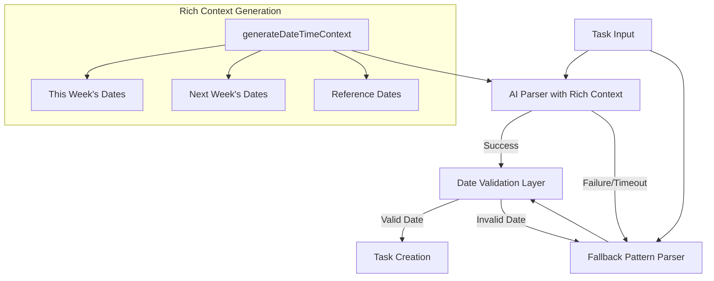

# Date Context Enhancement: Implementation and Lessons

## Overview

The date context enhancement is a significant improvement to the Gorlea Tasks system, addressing issues with date parsing in natural language task descriptions. By providing rich temporal context to the AI, we've dramatically improved the accuracy of date recognition and resolved problems with tasks being incorrectly marked as overdue.

## Implementation Details

### Key Components

1. **Rich Context Generation**
   ```javascript
   // Generate a rich date-time context with detailed date information
   function generateDateTimeContext() {
       const now = new Date();
       const currentDay = now.getDay();
       const weekdays = ['Sunday', 'Monday', 'Tuesday', 'Wednesday', 'Thursday', 'Friday', 'Saturday'];
       
       // Create context object with multiple date representations
       const context = {
           currentDateTime: {
               iso: now.toISOString(),
               readable: now.toLocaleString('en-US', { 
                   weekday: 'long', 
                   year: 'numeric', 
                   month: 'long', 
                   day: 'numeric',
                   hour: 'numeric',
                   minute: 'numeric',
                   timeZoneName: 'short'
               }),
               // Additional date formats...
           },
           currentWeek: [], // Will contain all days of current week
           nextWeek: [],    // Will contain all days of next week
           upcomingDates: {} // Special reference dates (tomorrow, month boundaries)
       };
       
       // Generate calendar-like data structures
       // ...
       
       return context;
   }
   ```

2. **Enhanced AI System Prompt**
   ```
   Today's complete date and time information:
   - Current date and time: Sunday, March 9, 2025, 5:30 PM PST
   - Today is Sunday, March 9, 2025
   - Current time is 5:30 PM PST
   - ISO format: 2025-03-09T17:30:00.000Z

   This week's dates:
         Sunday is March 9, 2025 (Today)
         Monday is March 10, 2025
         Tuesday is March 11, 2025
         Wednesday is March 12, 2025
         Thursday is March 13, 2025
         Friday is March 14, 2025
         Saturday is March 15, 2025
         
   Next week's dates:
         Sunday is March 16, 2025
         Monday is March 17, 2025
         ...
   ```

3. **Multi-Layered Validation**
   ```javascript
   // Validate the due date if present with enhanced validation
   if (parsedTask.dueDate) {
       // Check if the date is valid
       const dueDate = new Date(parsedTask.dueDate);
       if (isNaN(dueDate.getTime())) {
           // Invalid date, use fallback
       } else {
           // Check for dates suspiciously far in the past (>30 days)
           const oneMonthAgo = new Date();
           oneMonthAgo.setDate(oneMonthAgo.getDate() - 30);
           
           if (dueDate < today) {
               // Date is in the past, use fallback
           } else if (dueDate < oneMonthAgo) {
               // Date is suspiciously in the past, use fallback
           }
           
           // Check for dates unreasonably far in the future (>1 year)
           const oneYearFromNow = new Date();
           oneYearFromNow.setFullYear(oneYearFromNow.getFullYear() + 1);
           
           if (dueDate > oneYearFromNow) {
               // Log warning but keep the date - might be intentional
           }
       }
   }
   ```

## Architecture

The implementation follows a multi-layered approach:



## Key Benefits

1. **Improved Date Parsing Accuracy**
   - Understands complex date expressions like "next Friday" in proper context
   - Correctly identifies specific date formats like "Thursday March 13th"
   - Properly handles relative dates based on the current date context

2. **Reduced Overdue Task Issues**
   - Prevents tasks from being incorrectly marked as overdue
   - Validates dates against reasonable boundaries (not too far in past or future)
   - Provides fallback mechanisms when date parsing is ambiguous

3. **Better User Experience**
   - Users can use natural date expressions with confidence
   - Tasks appear in the correct timeline groups
   - Reduces confusion and frustration from date misinterpretation

## Lessons Learned

1. **Rich Context is Critical for AI Understanding**
   - AIs benefit significantly from comprehensive contextual information
   - Providing multiple representations of the same data improves interpretation
   - Calendar-style context helps with temporal relationships

2. **Multi-Layered Validation is Essential**
   - AI responses should always be validated against reasonable constraints
   - Fallback mechanisms are necessary for handling edge cases
   - Log detailed context information for debugging

3. **Architectural Patterns for AI Integration**
   - Separate context generation from AI interaction
   - Include multiple layers of validation and fallback
   - Design for graceful degradation when AI services are unavailable

## Future Improvements

1. **Further Date Pattern Support**
   - Add support for international date formats
   - Enhance recognition of holidays and special occasions
   - Implement more sophisticated recurring date patterns

2. **Context Personalization**
   - Adapt to user's preferred date formats over time
   - Remember user's common task patterns and dates
   - Consider user's timezone and locale settings

3. **Performance Optimization**
   - Cache generated date context when appropriate
   - Only regenerate context when the date changes
   - Balance context richness with prompt token usage
