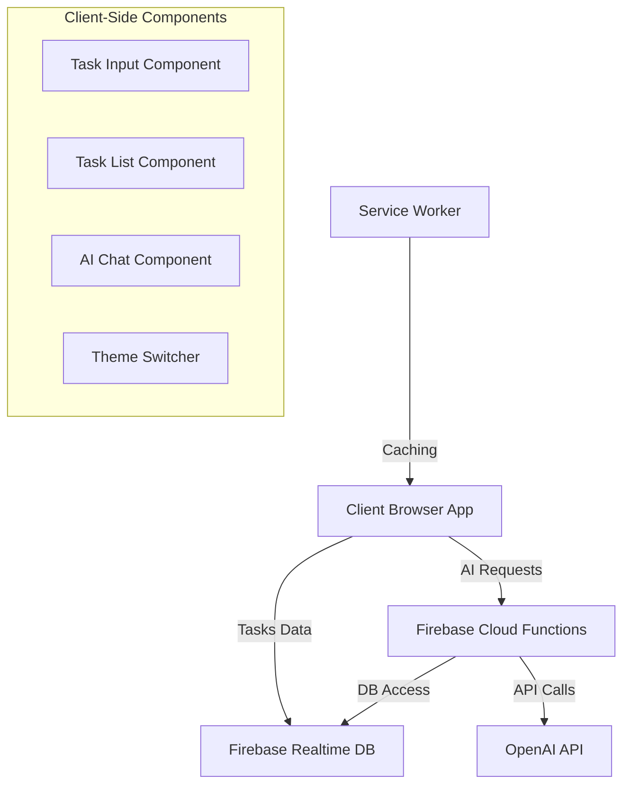
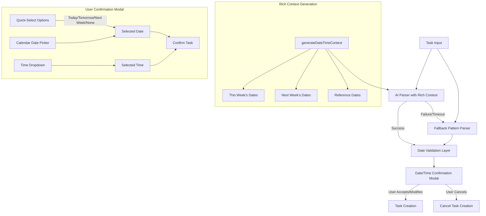

# System Patterns: Gorlea Tasks

## Architecture Overview

Gorlea Tasks follows a client-side web application architecture with cloud-backed services and AI integration. The system consists of these main components:



## Core Technical Patterns

### 1. Client-Side Application with Cloud Backend

The application follows a modern web architecture pattern:

- **Client-Side Single Page Application**: Pure JavaScript implementation without a framework
- **Firebase Realtime Database**: For real-time task synchronization across devices
- **Firebase Cloud Functions**: Backend API handling OpenAI interactions
- **Progressive Web App (PWA)**: For offline capabilities and native-like experience

### 2. Task Data Model

Tasks are stored as objects with a well-defined structure:

```javascript
{
  id: "unique-task-id", // Timestamp string
  title: "Task title",
  description: "Additional details",
  createdAt: "ISO date string",
  completed: false,
  dueDate: "ISO date string", // Optional
  dueTime: "HH:MM", // Optional
  priority: "high|medium|low",
  category: "work|personal|shopping|health|general",
  deviceId: "device-identifier",
  notes: "Additional notes" // Optional
}
```

### 3. AI Integration Patterns

The application uses a multi-layered approach to AI integration:

#### Direct Client-Side Integration
- Local task parsing with fallback algorithms when offline or for quick response
- Client-side API calls to OpenAI when the user provides their API key
- Rich contextual information provided to AI for improved understanding

#### Backend Integration via Firebase Functions
- More secure API key handling through Firebase Functions config
- Standardized endpoints for common AI operations:
  - `/parse-task`: Natural language task parsing
  - `/generate-followup`: Follow-up task suggestions
  - `/chat`: General AI assistant interactions

#### Graceful Degradation
- Fallback to basic functionality when AI services are unavailable
- Local parsing algorithms as backup to cloud AI
- Multi-layered validation to prevent incorrect interpretations

#### Contextual Enhancement
- Comprehensive date/time context generation for temporal AI operations
- Calendar view-style context model using `generateDateTimeContext()`
- Multiple format representations of the same data (ISO, human-readable, etc.)
- Both absolute dates and relational references (today, tomorrow, this week)

### 4. Real-Time Synchronization

The application implements bidirectional synchronization:

- **Device-to-Cloud**: Changes made on one device push to Firebase
- **Cloud-to-Device**: Firebase listeners update local state
- **Conflict Resolution**: Last-write-wins with device identifiers
- **Offline Support**: Service worker caching and local storage

### 5. Progressive Web App Implementation

The system follows PWA best practices:

- **Service Worker**: Caches critical assets for offline use
- **Manifest**: Defines app metadata for installation
- **Responsive Design**: Adapts to various screen sizes
- **Offline First**: Core functionality works without internet

### 6. UI Component Structure

The UI follows a centered, modular architecture:

- **Header**: App logo and theme toggle in a centered container
- **Task Input**: Natural language task entry with processing feedback
- **Search & Filter**: Combined search input and filter dropdown
- **Task List**: Scrollable, grouped task container with visual priority indicators
- **Chat Interface**: Modern AI assistant-style chat with dedicated container
- **Feedback System**: Transient status messages with color-coding

### 7. UI Visual Patterns

The UI implements several consistent visual patterns:

- **Centered Container**: All elements contained within a max-width centered container
- **Card-Based Components**: Each functional area has its own card with consistent styling
- **Custom Scrollbars**: Scrollable containers have styled scrollbars matching the theme
- **Visual Priority System**: Tasks have color-coded left borders indicating priority
- **Consistent Spacing**: Standard gap measurements between components
- **Responsive Breakpoints**: Specific adaptations at mobile breakpoints

### 8. Date Handling Architecture

The application uses a sophisticated approach to date parsing and handling, now enhanced with user confirmation:



#### Rich Context Generation
- `generateDateTimeContext()` creates comprehensive temporal information
- Multiple date formats (ISO, human-readable, etc.) for the same point in time
- Calendar-style week view with all days clearly identified
- Special reference dates (tomorrow, month boundaries, etc.)

#### Multi-Layered Date Validation
- Initial validation by AI with rich context
- Secondary validation of AI-returned dates against system time
- Detection of dates suspiciously far in the past (>30 days)
- Identification of dates unreasonably in the future (>1 year)
- Fallback to pattern-based detection when needed

#### Date Pattern Recognition
- Support for explicit formats (MM/DD/YYYY)
- Support for natural language (tomorrow, next Friday)
- Support for month name with day (March 15th)
- Support for day name with month and day (Thursday March 13th)
- Relative date expressions (this week, next month)

## Error Handling Patterns

The application implements several error handling strategies:

1. **Timeouts**: API calls have timeouts to prevent indefinite waiting
2. **Graceful Degradation**: Fallback to basic functionality when advanced features fail
3. **Retry Logic**: Important operations (like Firebase sync) retry on failure
4. **User Feedback**: Clear error messages with actionable information
5. **Connection Monitoring**: Active tracking of online/offline status
6. **Multi-Layered Validation**: Especially for date parsing and AI-interpreted content
7. **Contextual Logging**: Detailed context information alongside errors for better debugging

## Security Patterns

1. **API Key Security Model**:
   - **OpenAI API Key**: User-provided, sensitive credential stored only in localStorage
   - **Firebase API Key**: Included in code as it's designed for client-side use with security rules
   - **Secure Credential Handling**: Clear separation between public and private API keys

2. **Client-Side Credential Storage**: 
   - User's OpenAI API key stored securely in localStorage
   - Never transmitted except directly to the OpenAI API

3. **GitHub Pages Deployment Security**:
   - Designed for safe deployment to public repositories
   - No sensitive credentials in code
   - Firebase security rules protect from unauthorized access

4. **No Authentication**: Currently relies on anonymous access model
5. **Data Isolation**: Device IDs help segment data (preliminary approach)

## Performance Optimization

1. **Asset Caching**: Service worker caches static assets
2. **Lazy Loading**: Progressive content rendering
3. **Throttling**: Rate limiting for expensive operations
4. **Efficient Rendering**: Targeted DOM updates
